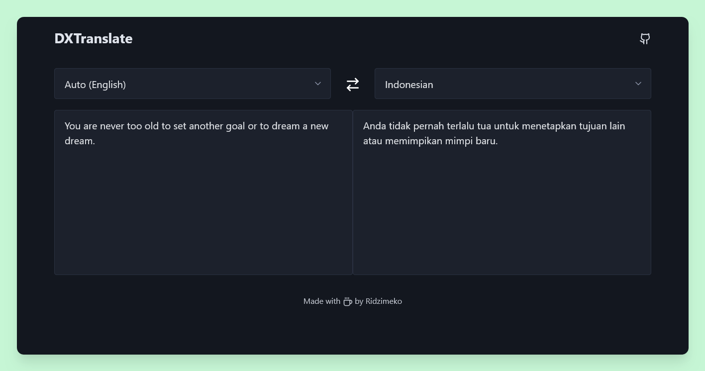

# DXTranslate


A simple, straightforward frontend translator powered by the DeepL API.



## 💡 Why DXTranslate?

The official [DeepL website](https://deepl.com) can feel a bit bloated and slow at times. I wanted something lightweight and snappy. That’s why I created DXTranslate! It’s a minimalistic version that gets the job done without fuss. Plus, you don’t need an API key or token—just input your text and go! 🚀✨

## ✨ Features

- **Privacy First**: No ads, cookies or tracking. 🍪
- **Token-Free**: No need for API keys; just start translating! 🔑❌
- **Self-Host**: Want to run it on your own server? Go for it! 💻🚀
- **Lightweight**: Fast response times without all the bloat. ⚡

## 📦 Getting Started

```bash
# clone the repository
git clone https://github.com/ridzimeko/DXTranslate.git

# change project directory
cd dxtranslate

# install dependencies
pnpm i

# start dev sever
pnpm dev
```

## 🤝 Contributing

Got ideas or want to help? Fantastic! You can follow these steps:

- Fork the repo
- Create a new branch (git checkout -b improve-feature)
- Make the appropriate changes in the files
- Add changes to reflect the changes made
- Commit your changes (git commit -am 'Improve feature')
- Push to the branch (git push origin improve-feature)
- Create a Pull Request

## 📜 License

This project is licensed under the **AGPL-3.0**.

Happy translating! 🌍💬
